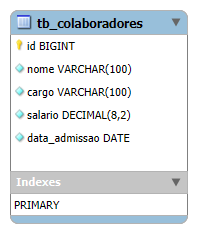

# Conselho do Recursos Humanos - Backend

<br />

<div align="center">
    
</div>


<br /><br />

## 1. Descrição

O projeto consiste no desenvolvimento de um software backend utilizando TypeScript e o framework NestJS. O objetivo principal é gerenciar o cadastro de funcionários da empresa, oferecendo uma interface robusta e segura para o departamento chamado <strong>Conselho do Recursos Humanos (CRH)</strong>.

### 1.1 Funcionalidades do projeto
1. Permite adicionar novos funcionários ao sistema com informações como:
  - ID
  - Nome
  - Cargo
  - Salário
  - Data de Admissão


2. Consulta de Funcionários:

- Busca avançada por nome e cargo.
- Visualização detalhada do perfil do funcionário.


3. Atualização de Dados:

- Alteração de informações cadastrais e contratuais, como cargo e salário.


------
<br>

## 2. Sobre esta API

<strong>Nest (NestJS)</strong> é uma estrutura para a construção de aplicativos Node.js do lado do servidor eficientes e escalonáveis. Ele usa JavaScript progressivo, é construído e oferece suporte total a TypeScript (mas ainda permite que os desenvolvedores codifiquem em JavaScript puro) e combina elementos de OOP (Programação Orientada a Objetos), FP (Programação Funcional) e FRP (Programação Funcional Reativa).
Nos bastidores, o Nest faz uso de estruturas robustas de servidor HTTP como o Express (o padrão) e, opcionalmente, pode ser configurado para usar o Fastify também!

O Nest fornece um nível de abstração acima desses Node.js comuns frameworks (Express/Fastify), mas também expõe suas APIs diretamente ao desenvolvedor. Isso dá aos desenvolvedores a liberdade de usar uma infinidade de módulos de terceiros disponíveis para a plataforma subjacente.

### 2.1. Principais Funcionalidades

- Estrutura Modular
- Suporte a TypeScript
- Injeção de dependências
- Testes facilitados
- Controlleres e Rotas
- Validação e serialização
- Integração com bibliotecas externas


------
<br>

## 3. Diagrama de Classes

```
@Entity({name: "tb_colaboradores"})

export class Colaborador{

    @PrimaryGeneratedColumn()
    id: number;

    @Transform(({ value }: TransformFnParams) => value?.trim())
    @IsNotEmpty()
    @Column({length: 100, nullable: false})
    nome: string;

    @Transform(({ value }: TransformFnParams) => value?.trim())
    @IsNotEmpty()
    @Column({length: 100, nullable: false})
    cargo: string;

    @Transform(({ value }: TransformFnParams) => value?.trim())
    @IsNotEmpty()
    @Column({nullable: false})
    salario: number;

    @CreateDateColumn()
    data_admissao: Date;

}
```

------
<br>

## 4. Diagrama Entidade-Relacionamento (DER)

Adicione a imagem do Diagrama

<div align="center">
    
</div>


------
<br>

## 5. Tecnologias utilizadas

| Item                          | Descrição  |
| ----------------------------- | ---------- |
| **Servidor**                  | Node JS    |
| **Linguagem de programação**  | TypeScript |
| **Framework**                 | Nest JS    |
| **ORM**                       | TypeORM    |
| **Banco de dados Relacional** | MySQL      |

------
<br>

## 6. Configuração e Execução

1. Clone o repositório
2. Instale as dependências: `npm install`
3. Configure o banco de dados no arquivo `app.module.ts`
4. Execute a aplicação: `npm run start:dev`

------
<br>

## 7. Colaboradores
`@ZarathosFreya`
`@Beatriz-Rodrigues-P`
`@brunop-lima`
`@emilyestvz`

`@fern-menezes`
`@Josadack`
`@VictorPestana`